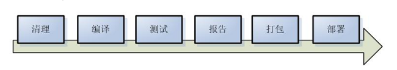
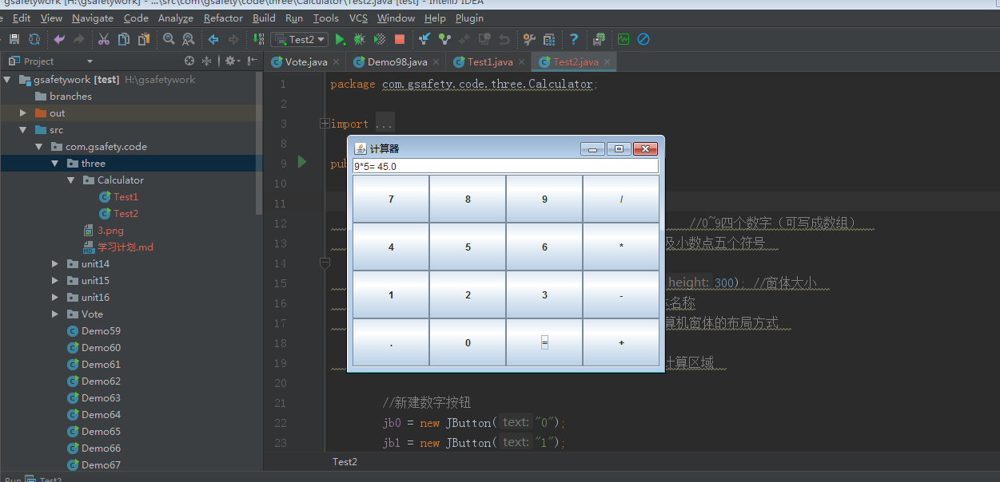
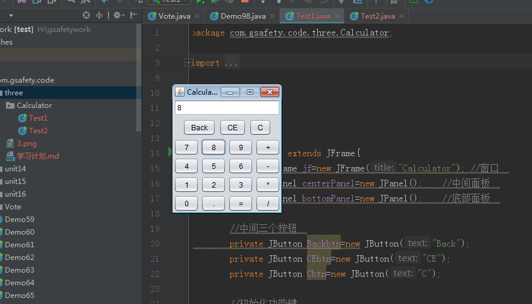
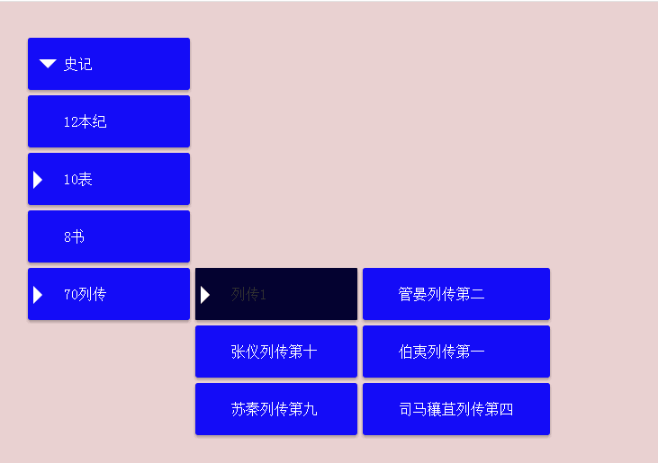

## 第三阶段工作任务与要求 ##

## 基本要求

 * 采用HTML、CSS、Bootstrap 、JavaScript。
 * IDE开发工具：VSCode。
 * 配置VScode前端开发插件环境。
 * 三大框架的整合以及maven的使用
 
##  任务 ##
* Windows计算器（简化版）： 实现加、减、 乘、 除基本功能。

* 多级下拉菜单
* 模拟实现京东或淘宝新用户注册流程
  + 其中需要填手机号或是邮箱获取验证码的功能，可采用ajax+后台假数据校验通过。
  + 加分项：  
     - 步骤之间跳转在同一页面。
     - 实现已注册用户登录功能，用户名和密码写入cookie，注册用户和
     匿名用户可看到不同的内容。 

##Web前端学习计划  ##

  1. 复习上个月的java基础
  1. bootstrap开发框架学习
  1. VSCode相关插件下载
  1. bootstrap下载
  1. js学习

##  ssm复习 ##

# 什么是maven #

    Maven是一个跨平台的项目管理工具，主要用于基于java平台的项目构建，依赖管理。

如图为项目构建的过程。

- 
- 
解决的项目的问题：

    1、如果有好几个项目，这好几个项目中，需要用到很多相同的jar包，能不能只建立一个仓库来解决这个问题？
    2、测试方法能不能全部运行呢？
    3、怎么样把一个模块的功能放入到仓库中

说明：

    bin中存放可执行的二进制文件

    conf存放settings.xml文件

    lib  运行maven所依赖的jar包

## maven的约定 ##
    src/main/java      存放项目的java文件
    src/main/resources  存放项目的资源文件，如spring，hibernate的配置文件
	src/test/java       存放所有的测试的java文件
    src/test/resources   存放测试用的资源文件
    target            项目输出位置
    pom.xml  文件

说明：

    maven根据pom.xml文件，把它转化成项目对象模型(POM)，这个时候要解析依赖关系，然后去相对应的maven库中查找到依赖的jar包。
    在clean，compile，test，package等阶段都有相应的Plug-in来做这些事情。而这些plug-in会产生一些中间产物。

# mybatis是什么？ #

    mybatis是一人持久层框架，mybatis是一个不完全的ORM框架。sql语句需要程序员自己去编写，但是mybatis也有映射（输入参数映射、输出结果映射）。

    mybatis入门门槛不高，学习成本低，让程序员把精力放在sql语句上，对sql语句优化非常方便，适用与需求变化较多项目，比如互联网项目。

2、 mybatis框架执行过程：

    1、配置mybatis的配置文件，SqlMapConfig.xml（名称不固定）

    2、通过配置文件，加载mybatis运行环境，创SqlSessionFactory会话工厂SqlSessionFactory在实际使用时按单例方式。

    3、通过SqlSessionFactory创建SqlSessionSqlSession是一个面向用户接口（提供操作数据库方法），实现对象是线程不安全的，建议sqlSession应用场合在方法体内。

    4、调用sqlSession的方法去操作数据。如果需要提交事务，需要执行SqlSession的commit()方法。

    5、释放资源，关闭SqlSession

3、 mybatis开发dao的方法：

    1、原始dao 的方法：需要程序员编写dao接口和实现类需要在dao实现类中注入一个SqlSessionFactory工厂。

    2、mapper代理开发方法（建议使用）只需要程序员编写mapper接口（就是dao接口）程序员在编写mapper.xml(映射文件)mapper.java需要遵循一个开发规范：

        1、mapper.xml中namespace就是mapper.java的类全路径。

	   2、mapper.xml中statement的id和mapper.java中方法名一致。

	   3、mapper.xml中statement的parameterType指定输入参数的类型和mapper.java的方法输入 参数类型一致。

       4、mapper.xml中statement的resultType指定输出结果的类型和mapper.java的方法返回值类型一致。

 4、SqlMapConfig.xml配置文件：可以配置properties属性、别名、mapper加载。。。

 输入映射：

	parameterType：指定输入参数类型可以简单类型、pojo、hashmap。。
	对于综合查询，建议parameterType使用包装的pojo，有利于系统 扩展。

输出映射：

	resultType：
		查询到的列名和resultType指定的pojo的属性名一致，才能映射成功。
	reusltMap：
		可以通过resultMap 完成一些高级映射。
		如果查询到的列名和映射的pojo的属性名不一致时，通过resultMap设置列名和属性名之间的对应关系（映射关系）。可以完成映射。
		高级映射：
			将关联查询的列映射到一个pojo属性中。（一对一）
			将关联查询的列映射到一个List<pojo>中。（一对多）

动态sql：（重点）

	if判断（掌握）
	where
	foreach
	sql片段（掌握）

# springmvc的基础知识 #

什么是springmvc？

springmvc框架原理（掌握）

	前端控制器、处理器映射器、处理器适配器、视图解析器
springmvc入门程序

	目的：对前端控制器、处理器映射器、处理器适配器、视图解析器学习
	非注解的处理器映射器、处理器适配器
	注解的处理器映射器、处理器适配器（掌握）
springmvc和mybatis整合（掌握）

springmvc注解开发：（掌握）

	常用的注解学习
	参数绑定（简单类型、pojo、集合类型）
	自定义参数绑定（掌握）

springmvc和struts2区别

springmvc的高级应用

	参数绑定（集合类型）
	数据回显
	上传图片
	json数据交互
	RESTful支持
	拦截器

### 任务1 ###
    Windows计算器（简化版）： 实现加、减、 乘、 除基本功能。

    package com.gsafety.code.three.Calculator;

    import javax.swing.*;
    import java.awt.*;
    import java.awt.event.ActionEvent;
    import java.awt.event.ActionListener;
    import java.util.ArrayList;
    import java.util.List;

    /**
      * created by yb
      * Date:2018/5/21
     */
     public class Test1  extends JFrame{
        private JFrame jf=new JFrame("Calculator"); //窗口  
        private JPanel centerPanel=new JPanel();    //中间面板  
        private JPanel bottomPanel=new JPanel();    //底部面板  

        //中间三个按钮  
        private JButton Backbtn=new JButton("Back");
        private JButton CEbtn=new JButton("CE");
        private JButton Cbtn=new JButton("C");

        //初始化功能键  
        String[] nums={"7","8","9","+","4","5","6","-","1","2","3","*","0",".","=","/"};
        private JButton btn7=new JButton(nums[0]);
        private JButton btn8=new JButton(nums[1]);
        private JButton btn9=new JButton(nums[2]);
        private JButton btnAdd=new JButton(nums[3]);
        private JButton btn4=new JButton(nums[4]);
        private JButton btn5=new JButton(nums[5]);
        private JButton btn6=new JButton(nums[6]);
        private JButton btnMimus=new JButton(nums[7]);
        private JButton btn1=new JButton(nums[8]);
        private JButton btn2=new JButton(nums[9]);
        private JButton btn3=new JButton(nums[10]);
        private JButton btnMultipus=new JButton(nums[11]);
        private JButton btn0=new JButton(nums[12]);
        private JButton btnDot=new JButton(nums[13]);
        private JButton btnResult=new JButton(nums[14]);
        private JButton btnDivide=new JButton(nums[15]);

        //单行输入文本框  
        private JTextField txt=new JTextField(15);
        private List<String> lists=new ArrayList<String>(); //用来记录用户输入的数字和操作符

        //主函数，程序入口  
        public static void main(String[] args){
            try {
                new Test1().init();
            } catch (Exception e) {
                System.out.println("程序异常终止");
                System.exit(0);   //退出虚拟机  
            }
        }
        //初始化  
        public void init() throws Exception{
            //使用网格布局方式  
            bottomPanel.setLayout(new GridLayout(4,4,3,3)); //左右上下间隔是3  
            //将功能键添加到底部面板中  
            bottomPanel.add(btn7);
            bottomPanel.add(btn8);
            bottomPanel.add(btn9);
            bottomPanel.add(btnAdd);
            bottomPanel.add(btn4);
            bottomPanel.add(btn5);
            bottomPanel.add(btn6);
            bottomPanel.add(btnMimus);
            bottomPanel.add(btn1);
            bottomPanel.add(btn2);
            bottomPanel.add(btn3);
            bottomPanel.add(btnMultipus);
            bottomPanel.add(btn0);
            bottomPanel.add(btnDot);
            bottomPanel.add(btnResult);
            bottomPanel.add(btnDivide);

            //将中间的三个按钮添加到中间面板  
            centerPanel.add(Backbtn);
            centerPanel.add(CEbtn);
            centerPanel.add(Cbtn);

            jf.add(txt,BorderLayout.NORTH);   //将单行文本框添加到窗口的 北部  
            jf.add(centerPanel);              //将中间面板添加到窗口中间（默认是中间）  
            jf.add(bottomPanel,BorderLayout.SOUTH);  //将底部面板添加到窗口的南部  

            //为C按钮添加事件监听  
            Cbtn.addActionListener(e->{
                lists.clear();    //将集合中的数据清零  
                txt.setText("");  //将 文本域的 值设置为空  
            });
            //为Back按钮添加事件监听         使用Lamdba表达式  
            Backbtn.addActionListener(e->{
                String text=txt.getText(); //得到输入框文本  
                if("".equals(text) || text.length()==1){
                    txt.setText(""); //如果是空文本或者文本长度为1，直接设为空  
                    return;
                }
                if(text.length()>1){ //如果文本的长度大于1就要向前截取  
                    text=text.substring(0,text.length()-1);
                    txt.setText(text);
                }
            });

            //为CE按钮添加事件监听  
            CEbtn.addActionListener(e->{
                //得到输入文本框  
                String text=txt.getText();
                if("".equals(text)){
                    return;
                }
                if("+".equals(text) || "-".equals(text) || "*".equals(text) || "/".equals(text)){
                    //表示要把+ - * /清除,所以要把集合中的第一个数也移除集合（因为用户可能点了+的时候，就点CE键，此时如果再点数字键就会出现问题）  
                    lists.remove(0);
                }
                txt.setText("");  //把文本直接清掉  
            });

            //为数字按钮添加监听事件     使用匿名内部类  
            ActionListener numBtnListener=new ActionListener(){
                @Override
                public void actionPerformed(ActionEvent e) {
                    //得到输入文本框的内容  
                    String text=txt.getText();
                    //判断有没有这句话 （0不能做分母，请清零后重试）,如果有 ，当点击数字按钮的时候要它消失  
                    if("除数不能为0".equals(text)){
                        txt.setText(e.getActionCommand());
                        return;
                    }
                    //如果第一个数是0，就不能输入其他数字了，只能输入小数点了  
                    if("0".equals(text)){
                        return;
                    }
                    if("".equals(text)){  //当文本域中没数据的时候，把当前点击的数字显示上去  
                        txt.setText(e.getActionCommand());
                    }else{
                        //如果当前输入框有数据，并且是操作符时，记录下该操作符  
                        if(text.equals("+") || text.equals("-") || text.equals("*") || text.equals("/")){
                            lists.add(text);  //将操作符添加到集合中  
                            txt.setText("");
                            text=""; //将得到的文本符空，也就是将+或-或 *或/赋空值  
                        }
                        text+=e.getActionCommand();
                        txt.setText(text);
                    }
                }
            };
            //为数字注册 监听器  
            btn1.addActionListener(numBtnListener);
            btn2.addActionListener(numBtnListener);
            btn3.addActionListener(numBtnListener);
            btn4.addActionListener(numBtnListener);
            btn5.addActionListener(numBtnListener);
            btn6.addActionListener(numBtnListener);
            btn7.addActionListener(numBtnListener);
            btn8.addActionListener(numBtnListener);
            btn9.addActionListener(numBtnListener);

            //为0按钮添加事件监听  
            btn0.addActionListener(e->{
                //得到输入文本框  
                String text=txt.getText();
                if("0".equals(text)){  //如果第一个数是0，不能再出现0了  
                    return;
                }
                //如果出现操作符,就记录下来  
                if("+".equals(text) || "-".equals(text) || "*".equals(text) || "/".equals(text)){
                    lists.add(text);
                    text="";  //把操作符情况  
                }
                text+=e.getActionCommand();
                txt.setText(text);
            });
            //为点  .按钮 添加事件监听  使用Lamdba表达式  
            btnDot.addActionListener(e->{
                //得到输入文本框  
                String text=txt.getText();
                if("".equals(text)){
                    return;
                }
                //判断文本是否为+ - * / .  
                if("+".equals(text) || "-".equals(text) || "*".equals(text) || "/".equals(text)){
                    return;
                }
                //如果该数字后面已经有小数点了，那么就不能连续出现两次小数点了  
                if(text.contains(".")){
                    return;
                }
                text+=e.getActionCommand();
                txt.setText(text); //设置进去  
            });

            //为+-*/添加事件监听    使用匿名内部类    
            ActionListener operationBtnListener=new ActionListener(){
                @Override
                public void actionPerformed(ActionEvent e) {
                    //获取输入文本框内的内容  
                    String text=txt.getText();
                    if("".equals(text)){
                        return;
                    }
                    if("+".equals(text) || "-".equals(text) || "*".equals(text) || "/".equals(text)){
                        return;
                    }
                    //将内容添加到集合中  
                    lists.add(text);
                    //将输入框清空  
                    txt.setText("");
                    //把按钮上面的字显示进去  
                    txt.setText(e.getActionCommand());
                }
            };
            //为* - + /注册监听器  
            btnAdd.addActionListener(operationBtnListener);
            btnMimus.addActionListener(operationBtnListener);
            btnMultipus.addActionListener(operationBtnListener);
            btnDivide.addActionListener(operationBtnListener);

            //为 =按钮添加事件监听  
            ActionListener resultBtnListener=new ActionListener(){
                @Override
                public void actionPerformed(ActionEvent e) {
                    //判断集合中的数据  
                    if(lists.isEmpty()){
                        return;
                    }
                    //获取文本输入框的内容  
                    String text=txt.getText();
                    if("".equals(txt) || "+".equals(text) || "-".equals(text) || "*".equals(text) || "/".equals(text)){
                        return;
                    }
                    //将其添加到集合中  
                    lists.add(text);
                    if(lists.size()<3){
                        return;
                    }
                    String one=lists.get(0);  //得到集合中的第一个数  
                    String two=lists.get(1); //得到集合中的第二个数  
                    String three=lists.get(2); //得到集合中的第三个数  
                    switch(two){
                        case "+":
                            double i=Double.parseDouble(one);
                            double j=Double.parseDouble(three);
                            txt.setText((i+j)+""); //显示结果  
                            break;
                        case "-":
                            double x=Double.parseDouble(one);
                            double y=Double.parseDouble(three);
                            txt.setText((x-y)+""); //显示结果  
                            break;

                        case "*":
                            double a=Double.parseDouble(one);
                            double b=Double.parseDouble(three);
                            txt.setText((a*b)+"");
                            break;
                        case "/":
                            double k=Double.parseDouble(one);
                            double h=Double.parseDouble(three);
                            if(h==0){
                                txt.setText("除数不能为0");
                                lists.clear();
                                return;
                            }
                            txt.setText((k/h)+"");
                            break;
                    }
                    //将集合中的数据清空  
                    lists.clear();
                }
            };
            //为=等号按钮注册监听器  
            btnResult.addActionListener(resultBtnListener);
            //自定义窗口的图标  
            ImageIcon image=new ImageIcon("image/girl.jpg"); //图片位置  
            image.setImage(image.getImage().getScaledInstance(30,30, Image.SCALE_DEFAULT));
            jf.setIconImage(image.getImage());
            //设置UI的风格为Nimbus  
            UIManager.setLookAndFeel("javax.swing.plaf.nimbus.NimbusLookAndFeel");
            //更新f窗口内所有组件的UI  
            SwingUtilities.updateComponentTreeUI(jf.getContentPane());
            jf.setDefaultCloseOperation(JFrame.EXIT_ON_CLOSE);//点X关闭窗口  
            jf.setLocation(400, 200); //初始化时定位  
            jf.setResizable(false);   //禁止拖曳改变窗口大小  
            jf.pack();               //让窗口的大小自适应  
            jf.setVisible(true);  //显示窗口  
        }
    }

### 任务2 ###
    静态页面的制动态特效的实现——下拉菜单的显示和隐藏
    css
    jquery
    js
    html

    <!DOCTYPE html>
    <html lang="en">
    <head>
    <meta charset="UTF-8">
    <title>下拉菜单</title>
    <link rel="stylesheet" href="m.css">
     </head>
    <body>
    

    

    <nav>
    <menu>
        <menuitem id="demo1">
            <a>史记</a>
            <menu>
                <menuitem><a>12本纪</a></menuitem>
                <menuitem>
                    <a>10表</a>
                    <menu>
                        <menuitem><a>三代世表第一</a></menuitem>
                        <menuitem><a>
                            十二诸侯年表第二</a></menuitem>
                        <menuitem><a>
                            十二诸侯年表第二</a></menuitem>
                        <menuitem><a>
                            十二诸侯年表第二</a></menuitem>
                    </menu>
                </menuitem>
                <menuitem><a>8书</a></menuitem>
                <menuitem id="demo2">
                    <a>70列传</a>
                    <menu>
                        <menuitem id="demo3">
                            <a>列传1</a>
                            <menu>
                                <menuitem><a>管晏列传第二</a></menuitem>
                                <menuitem><a>伯夷列传第一</a></menuitem>
                                <menuitem><a>司马穰苴列传第四</a></menuitem>
                            </menu>
                        </menuitem>
                        <menuitem><a>
                            张仪列传第十</a></menuitem>
                        <menuitem><a>苏秦列传第九</a></menuitem>
                    </menu>
                </menuitem>
            </menu>
        </menuitem>
    </menu>
    </nav>
    </body>

    </html>
### 页面显示 ###

### 测试网页 ###

    <button type="button" class="close" data-dismiss="alert" aria-hidden="true">&times;</button>
    <strong>here!</strong> do something  ...

    <button type="button" class="btn btn-danger">button</button>

    <button type="button" class="close" data-dismiss="alert" aria-hidden="true">&times;</button>
    <strong>here!</strong> do something ...

    <button type="button" class="btn btn-success">button</button>

<link rel="stylesheet" href="http://cdn.static.runoob.com/libs/bootstrap/3.3.7/css/bootstrap.min.css">

