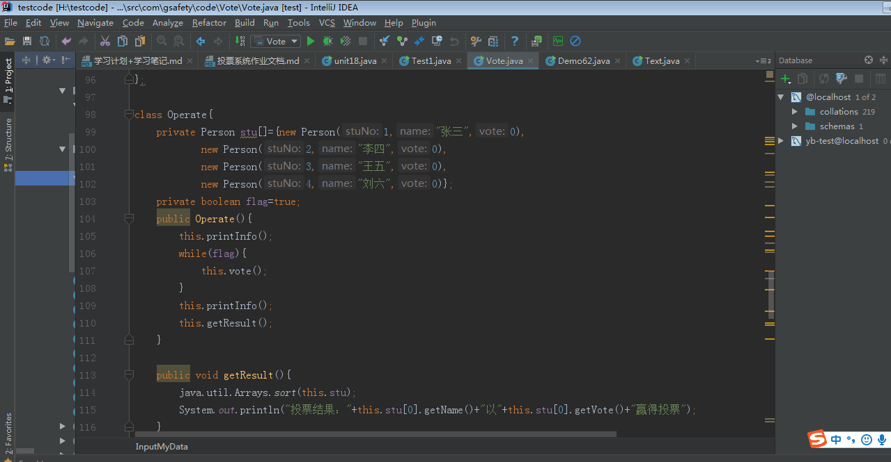
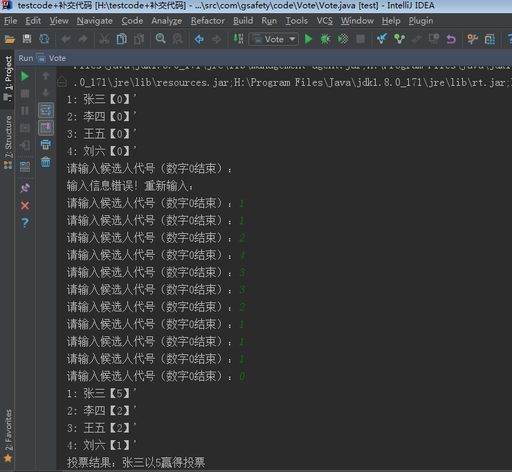
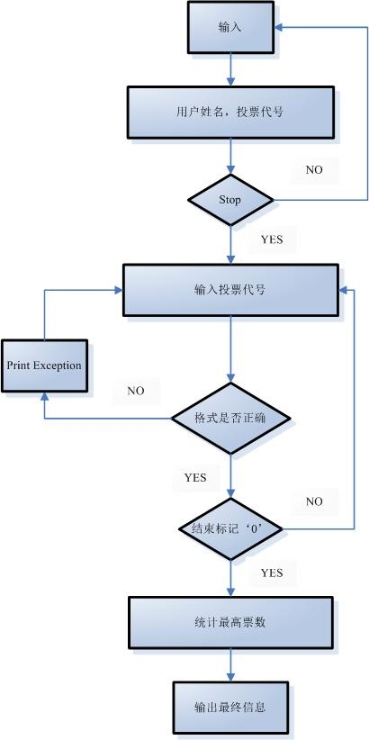

# 投票系统

## 涉及知识点

- Java语言基础、流程控制
- 类和对象、类的比较
- 自定义异常处理
- 集合类List使用、对象排序

## 需求分析

- （1）、编写候选人类Person，将候选人姓名、代号和票数保存到类Person中。

- （2）、输入数据之前，显示出各位候选人的代号及姓名：（提示：建立一个候选人类型数组）。

- （3）、循环执行接收键盘输入的班长候选人代号，直到输入的数字为0，结束选票的输入工作。

- （4）、在每次输入的选票要求验证该选票是否有效，即：如果输入的数不是0,1,2,3,4，这5个数字之一，或者输入一串字母（捕获异常），应显示出错误提示信息：此票无效，请输入正确的候选人代号！并继续等待输入。

- （5）、输入结束后显示所有候选人的得票情况。

- （6）、输出最终当选者的相关情况。

- （7）、信息打印要结构清楚，如投票输入与结果展示区域区分清晰。

## 功能分析

- 投票功能：

  - 输入投票代号，以'0'作为结束标记

- 判错功能：

  - 输入投票代号为字符串或者代号不在定义数字之内，显示异常‘此票无效'

- 统计功能：

  - 控制台打印输出票数最高候选人

  - 若出现票数最高不止一人，输出票数最高候选人信息，并提示'请重新投票'。

- **新增功能：**

  - 实现任意输入候选人用户姓名和投票代号，输入格式为：张三，2

  - 若出现票数最高不止一人，输出票数最高候选人信息，并提示'请重新投票'。

## 部分代码截图

- 

## 实现结果

- 

## 流程图

 

# 投票系统开发问题合集 #

1. 在服务端启动模块中，由用户输入的信息如何持久化到磁盘中？

解决方案一： 

    将用户输入的信息存储在集合中，一般使用最多的集合有Map、List，然后使用将集合写入文件中（比较常见，首选）。 而对于存储，有两种解决方式，一种是Map驱动，以key值作为对象的一个唯一属性，value再使用一个Map。

解决方案二： 

    一种是Bean驱动，将用户信息写成一个Bean类，以对象的一个属性作为key，对象作为value，组装成一个Map。

2.在服务端启动模块中，如何将端口信息写入到配置文件中进行持久化？

  解决方案一： 

     使用一个集合添加需要存储的字符串内容，然后将list集合写入到磁盘文件中。

3.常见存储文件信息的方案?

解决方案一： 

    存储在Bean对象类中，可以通过get和set方法来获得其相应的属性；
 
解决方案二： 

    存储在集合中，针对不同的需求，可以选取不同的集合，常用的集合Map、List、Set；

4.如何从配置文件中读取内容并同时需要时从该方法外获得？

解决方案一：
 
    将读取的内容以List集合的形式返回，然后return给调用者； 
解决方案二： 

    如果不是很多的内容，可以采用组装成StringBuffered字符串形式返回给调用者。

5.中文乱码的原理以及解决方案

    对于单机上的中文乱码的问题，最大可能就是文件编码格式不一致，记事本默认编码格式是GBK2312，而editPlus编码格式是ANSI，文件存储字符的格式方式是不一样的，那么在读文件和写文件时很容易出现编码不一致导致中文乱码，最简单最直接的方式是使两者编码格式保持一致，而对于多台机器而言，中文乱码显得确实很普遍，那么这中间就需要使用一个过滤器来解决乱码问题。

**备注**

- 所有学习工作文件已提交至GitHub：<https://github.com/ybgitcom/testcode.git>

- 最近在准备PPT答辩还有论文降重一些事所以代码还有很多不足之处。